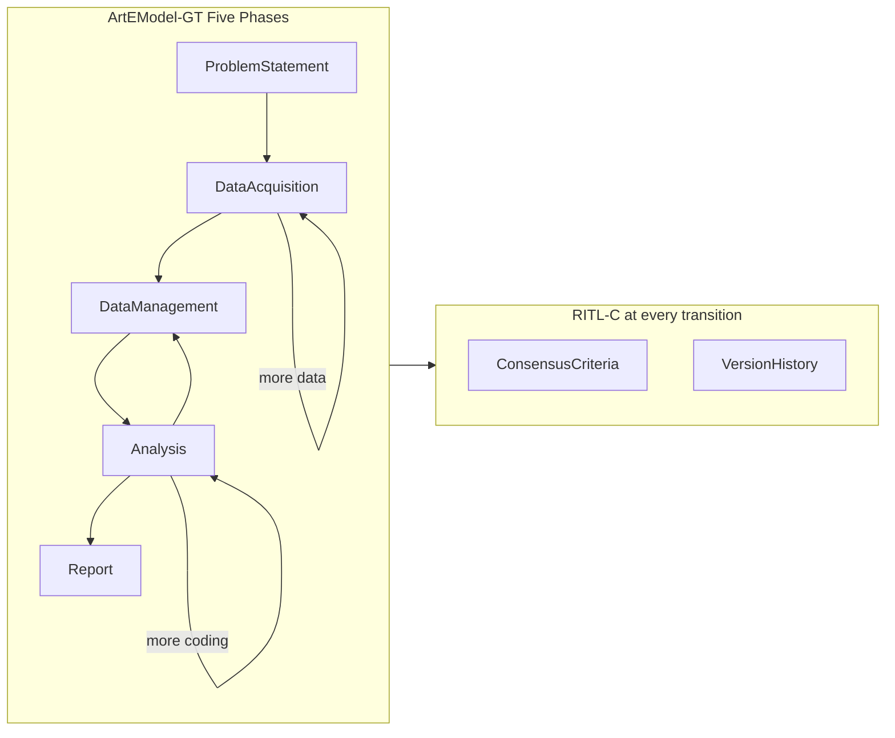

# Mentor: Grounded Theory Curation Prototype

## Thesis alignment

Your thesis (*Modelling the Curation of Grounded Theory Research Artefacts*, Alejandro Adorjan, MENTOR project) defines three pillars this prototype must express:

| Model | Prototype expression |
|-------|---------------------|
| **GTA-DCM** | Typed entities for artefacts, research context, actors, process, and consensus criteria |
| **ArtEModel-GT** | 5-phase workflow with iterative backtracking (e.g. "more data", "more coding") and artefact status transitions |
| **RITL-C** | Researcher-in-the-Loop consensus at stage transitions; versioned change log with rationale |

The provided Mentor screenshots map directly to thesis Section 5.4 (Figures 5.3–5.5): Kanban-style lifecycle, Problem Statement cards, Data Acquisition timeline, coding UI, and theory/consensus views.



## Tech stack (greenfield)

- **React 19 + TypeScript + Vite** — fast local dev, matches thesis prototype style
- **Tailwind CSS 4** — light Mentor UI (white/gray, blue accents) from screenshots
- **Lucide React** — sidebar and activity icons
- **D3 or React Flow** — theory/category relationship graph (Analysis phase)
- **Local persistence** — `localStorage` + JSON import/export (no backend for v1)
- **RO-Crate JSON-LD export** — FAIR-oriented packaging per thesis Section 5.4

## Domain model

Central types file: [`src/types/domain.ts`](src/types/domain.ts)

Core enums and entities from thesis Tables 4.2–4.6:

```typescript
// Phase lifecycle (ArtEModel-GT)
type TypeOfStatus = 'problem_statement' | 'acquisition' | 'management' | 'analysis' | 'report';

// Artefact metadata (GTA-DCM)
interface Artifact {
  id: string;
  hashID: string;          // SHA-256 of content
  name: string;
  content: string;
  type: 'interview' | 'observation' | 'document' | 'protocol' | 'bibliography';
  media: 'video' | 'text' | 'audio' | 'dataset' | 'software';
  access: 'public' | 'private';
  status: TypeOfStatus;
  responsibleId?: string;
  curation: { format: string; source: string; dateCreated: string; consentObtained: boolean; participantId?: string };
}

// Research context (Problem Statement cards)
interface TheoreticalFramework {
  researchQuestions: ResearchQuestion[];
  methods: Method[];
  tools: Tool[];
  bibliographyContent: string;
  methodology: 'classic' | 'constructivist' | 'straussian';
}

// GT elaboration
interface Code { id: string; name: string; color: string; relatedCodeIds: string[]; }
interface Category { id: string; name: string; codeIds: string[]; relatedCategoryIds: string[]; }
interface Theory { id: string; type: TheoryType; content: string; categoryIds: string[]; }

// RITL-C
interface ConsensusCriteria { id: string; name: string; votingType: 'unanimous' | 'majority' | 'consensus'; description: string; }
interface ChangeRecord { id: string; timestamp: string; authorId: string; category: 'research_question' | 'methods' | 'framework' | 'bibliography' | 'artefact'; action: string; rationale: string; status: 'committed' | 'draft'; }
interface Vote { id: string; targetId: string; researcherId: string; decision: 'approve' | 'reject' | 'abstain'; }
```

State store: [`src/store/projectStore.ts`](src/store/projectStore.ts) — single project context with actions for CRUD, phase transitions, voting, and changelog append.

## Application shell (matches screenshots)

```
src/
  App.tsx                    # Router + layout
  components/
    layout/
      Sidebar.tsx            # Mentor nav: Dashboard, CodeBook, Scientist sub-nav, Settings
      Header.tsx             # Breadcrumb, search, notifications, user avatar
    problem-statement/
      SummaryCards.tsx       # RQ, Methods, Theoretical Framework cards
      RecentChanges.tsx      # Commit-style changelog + filter tabs
    acquisition/
      AcquisitionTabs.tsx    # All | Collect External | Collect Internal | Explore | Verify | Clean
      RecentEntryCard.tsx    # Highlighted artefact (ID, instrument, researcher, timestamp)
      ActivityTimeline.tsx   # Date-grouped activity rows with type pills
      UploadPanel.tsx        # Upload instrument placeholder
    management/
      ContextPanel.tsx       # Evaluate + contextualize artefacts
    analysis/
      CodingWorkspace.tsx    # Transcript + inline code highlights + sidebar
      TheoryGraph.tsx        # Category/code network
      ConsensusPanel.tsx     # Team votes on codes/categories/theory
      MemoPanel.tsx          # Reflexivity memos linked to segments
    report/
      ReportBuilder.tsx      # Sectioned final report linked to artefacts
    shared/
      ArtifactCard.tsx, Badge, PhasePill, ResearcherAvatar
  lib/
    hash.ts                  # hashID generation
    roCrateExport.ts         # RO-Crate packaging
    seedData.ts              # Demo project payload
  pages/
    Dashboard.tsx, CodeBook.tsx, ProblemStatement.tsx, DataAcquisition.tsx,
    DataManagement.tsx, Analysis.tsx, Report.tsx, Settings.tsx
```

### Sidebar navigation (Scientist workflow)

Matches screenshot hierarchy:

- **Dashboard** — project overview, phase progress, team roster
- **CodeBook** — browse all codes/categories with saturation indicators
- **Scientist** (expandable):
  - Problem Statement
  - Data Acquisition
  - Data Management
  - Analysis
  - Report
- **Settings** — project metadata, consensus criteria config, export
- **Notify Researchers** — stub action (toast/modal listing team)

## Phase-by-phase features

### 1. Problem Statement (primary landing)

Reproduce screenshot layout for project **"Curation and Exploration"**:

- **Header**: back breadcrumb, "Updated 5min ago", Export button
- **Three summary cards**:
  - Research Questions — RQ1 about sociocultural communication in Montevideo photo murals; Grounded Theory methodology pill
  - Methods — Interview, City/Country, 23 informants
  - Theoretical Framework — attached doc "The Discovery of Grounded Theory"
- **Recent Changes** section:
  - Commit card: `ADD: fixed RQ` with `Committed` status, rationale/proposal fields
  - Filter tabs: All | Research Questions | Methods | Theoretical Frameworks | Bibliography | View Changes
  - Detail entry: modified by Regina Motz, timestamp, note body, category tag

**RITL hook**: editing RQ/methods/framework creates a `ChangeRecord`; stage advance requires consensus vote if criteria configured.

### 2. Data Acquisition

Reproduce screenshot layout:

- Sub-tabs: All, Collect External Data, Collect Internal Data, Explore Data, Verify Reliability, View Metadata, Clean Data
- **Recent Changes** card: OCT 17 entry — RW50011, Interview, Rosalia Winocur, Video button
- **Upload** panel for instruments
- **Activity timeline**: grouped by date (22 JUL, 17 JUL…) with artefact ID, researcher, description, type pill (Interview/Survey/Workshop), task title

**ArtEModel-GT**: artefacts created here start with `status: acquisition`; drag or action to advance to `management` triggers RITL checkpoint.

### 3. Data Management

- Artefact list filtered to `management` status
- Metadata editor: format, provenance, consent, participant link
- Contextualization notes (link artefact to RQ and field of study)

### 4. Analysis (coding + theory + consensus)

Thesis Figure 5.4 + 5.5:

- **Coding workspace**: select transcript artefact; highlight spans; assign open codes; sidebar code list with colors
- **Category builder**: nest codes into categories (descriptive → analytical, per U C1 mapping Table 5.3)
- **Theory graph**: visualize category relationships (D3 force layout)
- **Consensus panel**: team members vote on code/category/theory proposals; voting type from `ConsensusCriteria`
- **Memo panel**: reflexivity journal entries linked to artefact segments (transversal per thesis)
- **Backtrack actions**: "Request more data" / "Revisit coding" buttons that move artefact status backward per ArtEModel-GT loops

### 5. Report

- Structured report sections (background, methods, results, conclusion) linked to source artefacts
- Privacy check before export (access levels)
- **Export options**: Markdown report, full project JSON, **RO-Crate** bundle

## Seed data

[`src/lib/seedData.ts`](src/lib/seedData.ts) — blend screenshot case + thesis U C1:

| Source | Content |
|--------|---------|
| Screenshots | Montevideo murals RQ, researchers Regina Motz / Rosalia Winocur, activity timeline entries |
| Thesis U C1 | 40 communication students, descriptive/analytical coding manuals, team consensus on coding, transmedia study strategies theory |
| Thesis model | Junior/Senior researcher roles, unanimous/majority consensus criteria, constructivist GT |

Pre-load 3–5 interview transcript artefacts, 8–12 codes, 4 categories, 1 emerging theory draft, 6+ changelog entries, and 3 researchers.

## RO-Crate export

RO-Crate packaging is implemented in [`src/store/projectStore.ts`](src/store/projectStore.ts):

- Package project metadata, artefacts, codes, categories, theory, bibliography, and provenance
- Map `hashID` → `@id`, researcher roles → `author`, phase → `creativeWorkStatus`
- Download as `mentor-project-rocrate.zip` (JSON-LD + artefact files)

## Visual design tokens

Light Mentor theme from screenshots:

- Background: `#F5F6F8` / white cards
- Primary blue: `#2563EB` (active nav, pills, buttons)
- Status pills: orange `Committed`, purple `Grounded Theory`, gray category tags
- Typography: system sans-serif, semibold section headers
- Sidebar width: ~240px; card border-radius ~12px

## Out of scope for v1

- Real authentication / multi-user sync (simulate researcher switch locally)
- Taguette integration (thesis noted limited researcher adoption)
- Gemini/AI-assisted coding (optional future layer)
- Full OWL/GTA-OM ontology editor (reference only in Settings as "Ontology view" stub)

## Verification checklist

After implementation, manually walk the U C1 narrative from thesis Section 5.1:

1. Problem Statement shows RQ evolution with committed changelog entry
2. Data Acquisition timeline lists interview artefacts with researcher accountability
3. Analysis: code interview spans → build categories → team consensus vote → theory graph updates
4. "More data" backtrack moves artefact from Analysis → Acquisition
5. Report exports with linked artefacts; RO-Crate zip validates structure
6. All five phases reachable from Scientist sidebar; UI matches screenshot layout on Problem Statement and Data Acquisition
